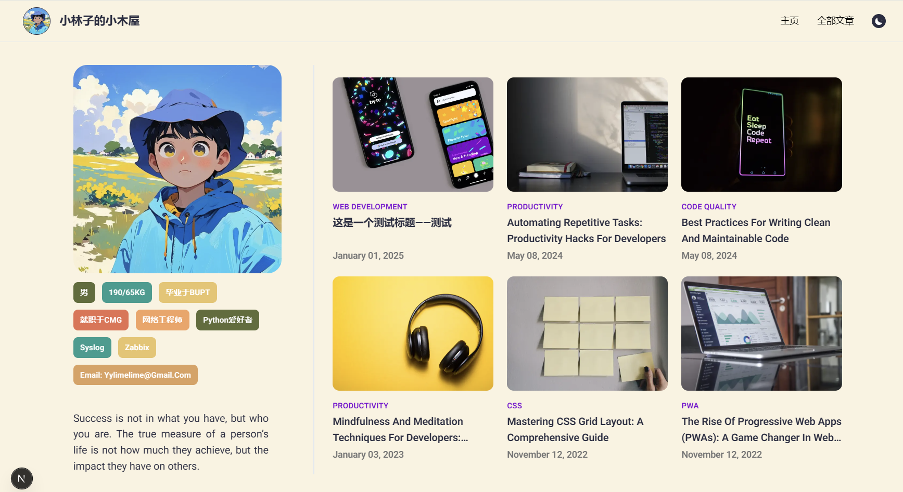

### 根据YouTube学习的博客网站
[参考视频](https://www.youtube.com/watch?v=1QGLHOaRLwM&list=WL&index=4&t=6283s)


修改为自己喜欢的样式


## Getting Started
```
yarn install && yarn dev
```

### update
 - 2025-04-06 修复了部分的显示bug，删除了旧的博客内容。
 - 2025-04-05 更正了主页部分显示样式
 - 2025-04-02 设计了配色，优化了部分无用的网页
 - 2025-04-02 开始重新排版主页，进行重新设计
 - 2025-03-31 完成了所有的基本功能，从npm切换到yarn，从contentlayer切换到velite.js
 - 2025-03-28 21:01:03 完成基本的页面，超链接都可以完成，下一步进行云上的数据读写
 - 2025-03-28 14:11:00 现在进度到了标签页面，blog页面基本完成
 - 2025-03-27 使用了nextjs@13来使用contentlayer，更新第一次readme
  